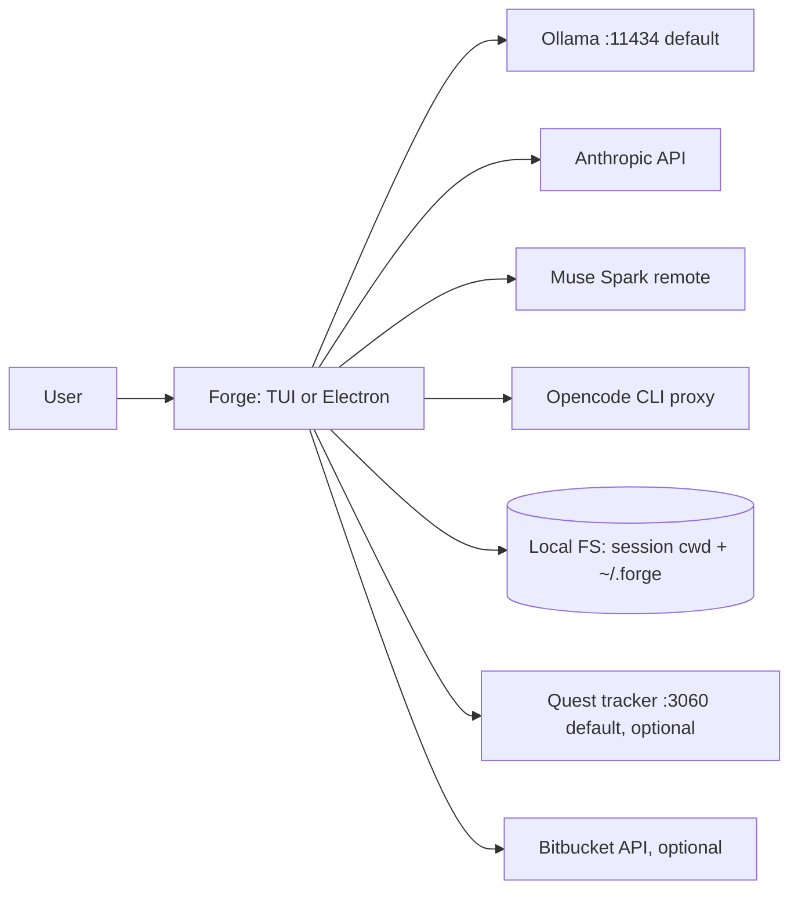

# 01 — Context (C1)

> **Mission:** fully customizable, transparent AI client with mod support — so everyone can easily make it their own.

Forge is a personal AI assistant that runs on your own machine. It ships as two deployables over one shared core (detail in `02-containers.md`): a terminal UI (TUI, run with `bun src/main.tsx`) and an Electron desktop app (`electron/main.ts` + `public/index.html`). Both talk to model endpoints, operate on your files via agent tools, and persist state under `~/.forge/` (`~` = your home directory).

Key terms used in this file: **cwd** = current working directory — the folder agent tools operate in, stored per chat session. **Mod** = a user-written JavaScript plugin in `~/.forge/mods/<name>/` that can add tools, `/commands`, prompt skills, and event hooks (full model in `06-mods.md`). **Session** = one chat conversation with its own message history, cwd, and model choice (storage in `05-data.md`). **Tools** = the six built-ins the model can call: read, write, edit, bash, glob, grep (behavior in `03-components.md`).

## Actors & externals

- **User**: single local operator. Owns the machine, the session cwd, and `~/.forge/`.
- **Model endpoints** — all built, selected per session via `~/.forge/config.json` (schema `src/config.ts:7-31`, wiring `src/providers/registry.ts:16-35`):
  - Ollama local, default `http://127.0.0.1:11434/v1` (default model `qwen3.6:35b-a3b-coding` — current default as of 2026-09, changeable in config)
  - Anthropic API via `ANTHROPIC_API_KEY` (default `claude-sonnet-4-5` — current default; no list-models API, so a bad key/unreachable API only surfaces as an error at chat time, not at boot)
  - Muse Spark remote via `MUSE_SPARK_BASE_URL` + key (transport detail in `03-components.md`)
  - OpenAI-compatible via baseURL + key + headers (opt-in reasoning flag; detail in `03-components.md`)
  - Opencode CLI proxy via local subprocess (session-pinning detail in `03-components.md`)
- **Local filesystem**: session cwd for tools (`src/agent/tools/*`, `~/` expansion in `src/agent/tools/paths.ts:6`); mod source `~/.forge/mods/<name>/index.{js,mjs}`; app state `~/.forge/` (config, sessions, repos).
- **Quest tracker** (optional): local web app expected at `http://localhost:3060` (default, changeable where the tracker runs); embedded in the Electron window via an Electron embed view (WebContentsView — a native sub-pane inside the app window, `electron/main.ts:103-118`). Forge works without it; the panel just shows no data.
- **Bitbucket API** (optional, read-only preview): pull-request (PR) inbox preview (`electron/main.ts:12,362`). Forge works without it.

## Trust boundary

Everything inside `~/.forge/` + the app process is trusted. Untrusted: model output, mod JavaScript (runs in-process with full Node power — a malicious mod is remote code execution (RCE): it can read files and run commands as you), tool results (file/command output), Bitbucket/Quest HTTP responses.

## Start here

1. Read next: `02-containers.md` (which deployable runs what, how they share `src/`).
2. Run one: TUI with `bun src/main.tsx` (needs at least one provider: local Ollama running, or `ANTHROPIC_API_KEY` set) or desktop with `bun run electron:start`.
3. Nothing is blocked on another person — all externals above are optional except one configured model provider.
