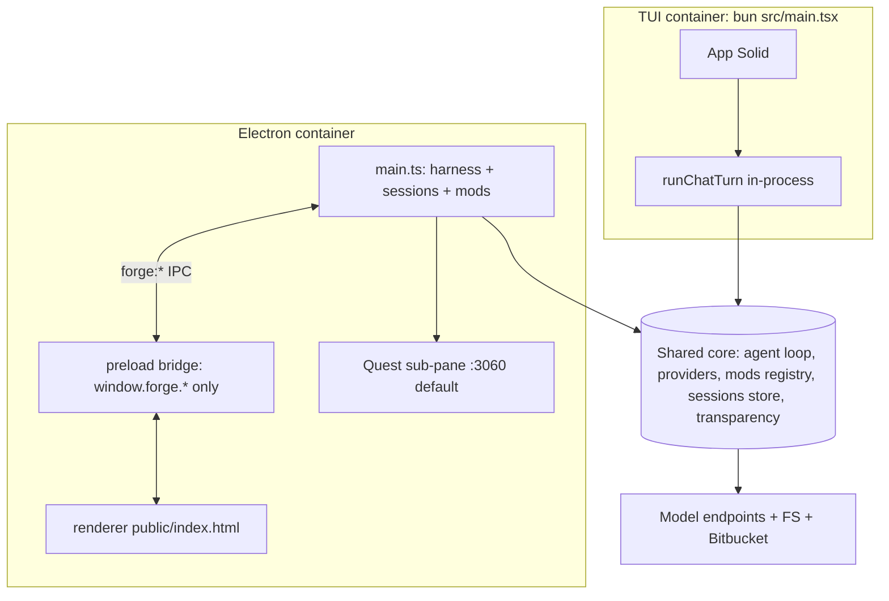

# 02 — Containers (C2)

Two deployables (separately runnable apps), one shared core (`src/` — the agent loop, providers, harness, mods, sessions, transparency from `03-components.md`).

## TUI runtime (terminal app)

Run: `bun src/main.tsx`. Entry `src/main.tsx:9-39` boots in order: (1) load `~/.forge/config.json`, (2) load mods, (3) resolve model providers, (4) reopen the most recently updated chat session, or start an empty one if none exists, (5) draw the fullscreen terminal UI (`render(<App/>)`, exits on Ctrl-C).
- `src/tui/app.tsx`: UI state (messages, busy flag, streaming draft, selected provider/model) uses Solid signals — Solid is the UI framework, a signal is its reactive variable. Keyboard: Ctrl-C exits, Ctrl-P cycles provider, Ctrl-M cycles model. The TUI calls the agent loop (`runChatTurn()`) directly in-process — no inter-process communication (IPC).
- Boot fails fast with a setup hint if zero usable providers are configured (`src/main.tsx:20-28`).

## Electron runtime (desktop app)

Run: `bun run electron:start`. `boot()` in `electron/main.ts:120-143`: same steps 1–4 as TUI, then wraps each provider in a harness object (a uniform `runTurn()` wrapper, see `03-components.md`) and appends the Claude Code CLI harness. It then restores whichever model each session last used instead of defaulting to the first one (`restoreModelForSession`, `electron/main.ts:53-60`).
- Window: an Electron `BrowserWindow` (a native desktop window hosting web content) loads `public/index.html`. A `preload` script (`electron/preload.ts`, built to `dist/preload.cjs`) exposes only a safe `window.forge.*` API to the web page; `contextIsolation:true` + `nodeIntegration:false` (`electron/main.ts:62-77`) mean the page cannot touch Node or Electron directly — every action goes through checked IPC channels.
- IPC: the web page calls main-process functions (`forge:*` channels, `electron/main.ts:157-378`, full map in `04-runtime.md`); the main process pushes live updates back as window events (`forge:delta` for streaming text, `forge:transparency` for tool/status events, `forge:done`/`forge:error` to finish).
- Quest modal: the optional Quest tracker page is embedded as a native sub-pane (WebContentsView) added/removed on demand, resized with the window (`electron/main.ts:92-118`).

Read next: `03-components.md` for what the shared core contains; `04-runtime.md` for the full IPC map.
