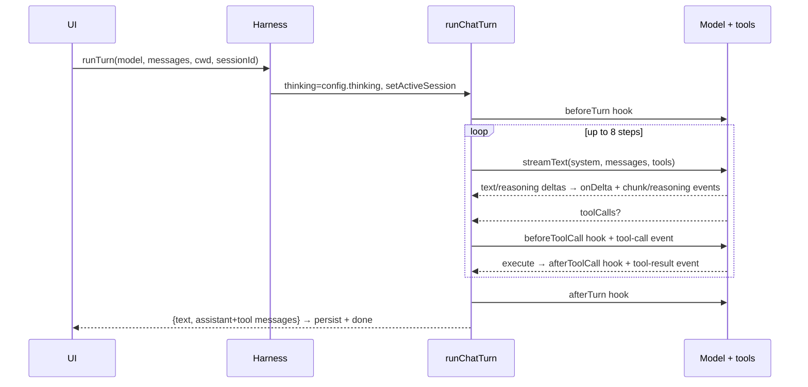

# 04 — Runtime

All built. Covers one chat turn and the Electron message channels.

## Chat turn (both UIs; Electron wraps it in IPC)

Cancel: each turn gets an `AbortController` (a standard cancel token passed down to the streaming call and tool executions). Electron's `forge:stop` triggers it (abandons the turn mid-stream); the TUI's Ctrl-C exits the whole app. Failures: unknown tool name → stored as a failed tool result (`ok:false`, text `Unknown tool: …`); tool throwing → error text stored as failed result; stream errors emit an `error` event; the UI appends a `⚠ <message>` assistant bubble so failures stay visible in history.

## Electron IPC (message channels between web page and main process)

`electron/main.ts:157-378`, safe bridge `electron/preload.ts`. Two patterns: **invoke** (page asks, main answers) and **push** (main streams live updates to the page).

Invoke, by purpose:
- Models/session/chat: `models`, `setModel`, `getSession`, `sessions`, `loadSession`, `newSession`, `chat`, `stop`, `getSystemPrompt`, `getTranscript`
- Slash commands + skills: `command`, `skills`, `setSkillLoaded`
- Mods (3 scopes): `mods`, `modsForScope`, `setModScopedEnabled`, `setModScopedSettings`
- Config/lifecycle: `getConfig`, `setConfig`, `relaunch`
- Integrations/shell: `questPreview`, `prInboxPreview`, `openQuestTracker`, `closeQuestTracker`, `openPath`, `openExternal`

Push (main → page): `forge:delta` (streaming text), `forge:transparency` (tool/status events), `forge:done` / `forge:error` (turn end).

Notes: `forge:command` parses `/name args`; `/cd` is core-guarded (handled in main before mod lookup, so no mod can hijack it) and validates the directory exists before saving it as the session cwd; mod commands dispatch after recording the active session so per-repo/per-session enablement resolves even on the first message (`electron/main.ts:249-278`). `forge:chat` stamps every transparency event with its turn number before appending to the events file. That `turn` index is the cross-event correlation id (persisted and live pushes alike — no separate `turnId`; `callId` stays per-call). Rotation segments (`<id>.events.jsonl.<epoch>`, 1MB threshold) merge in epoch order under the same bound; nothing is ever deleted. The in-memory `transcript` array caps at 2000 events (a per-process ring buffer — for debugging past sessions use the durable `<id>.events.jsonl` file, see `05-data.md`). Session replay loads the latest 500 events by default with no truncation indicator (accepted limitation until full rotation lands).

Notices repeat-throttle: `publishNotice` collapses identical `(source, name, data)` repeats (canonical key order, envelope excluded), counting suppressions and reporting `_suppressedRepeats` on the next change; `-error` names, `{ok:false}` data, and explicit `dedup: false` always pass. State is per-process memory — restart resets.
